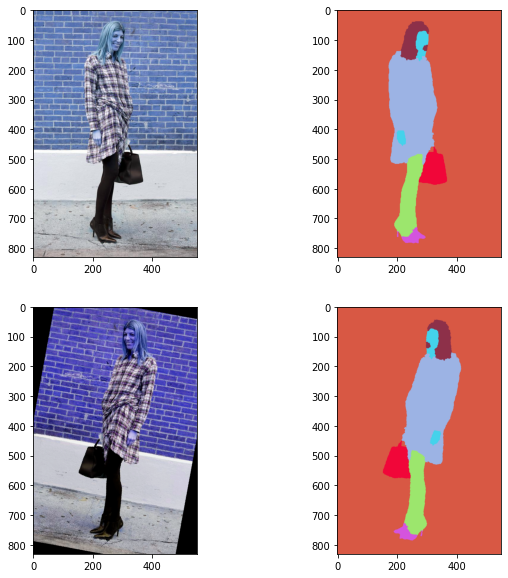
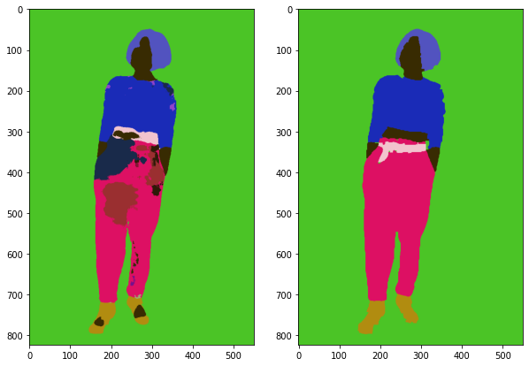
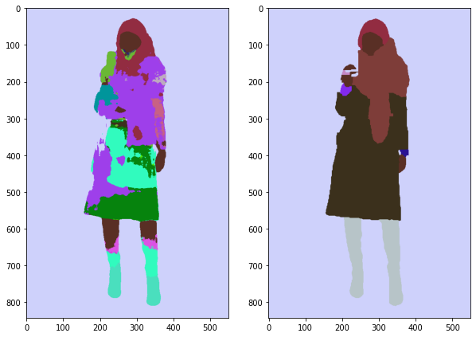
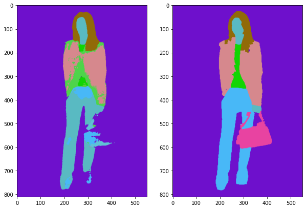

# Pytorch-Clothing-Parsing

- Dataset: Clothing-Co-Parsing 
    - https://github.com/bearpaw/clothing-co-parsing
- The model code is referenced from https://www.youtube.com/watch?v=IHq1t7NxS8k
- To Do
    - <input type="checkbox" checked> Batch
    - <input type="checkbox" checked> Data Augmentation
    - <input type="checkbox" checked> Image Normalization
    - <input type="checkbox" checked> Visualize Label Images

- Result
    - Mean of Mean IOU in valid set
        - 0.4237

    - Data Augmentation
    
        
    
    - Mean IOU in valid set
        - Max
        
            
        - Min
        
            
        - Average
        
            

